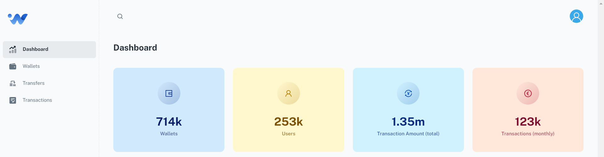

## Full-Stack Wallet App
Full stack web app with React and Spring Boot used for managing digital wallet and transactions.

 

 

 

### Description
This application allows users to implement e-wallet with REST API to create it, top it up, check its balance and withdraw. 
Users can register and login to the system using their credentials. They can also add any wallets for any account provided by IBAN 
and transfer to their wallet or any other wallet defined in the system.
